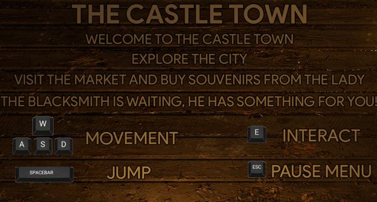
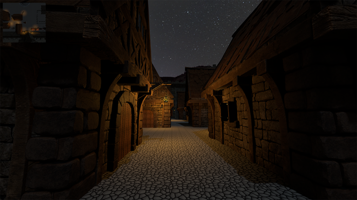
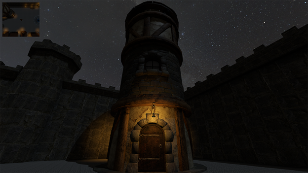
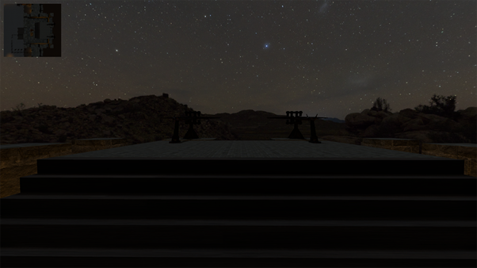
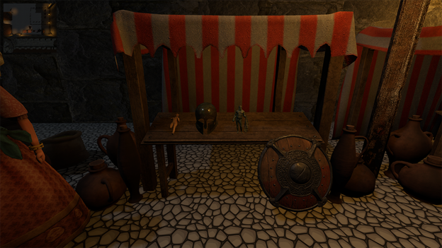

# CastleTown

Designed and developed a 3D exploration and interaction game in Godot 4.4, applying core Human-Computer Interaction (HCI) principles. 
Created an engaging gameplay experience combining narrative, navigation, and interactive elements, utilizing the Dialogic plugin for dialogue management.

Download link: https://drive.google.com/drive/folders/151gWggn11oX_aKgGPvMw6gsIctUdD2uv?usp=sharing

# Intro

# Town

# Commander's Tower

# Castle Walls

# Lady Market
Buy items from the lady. 
